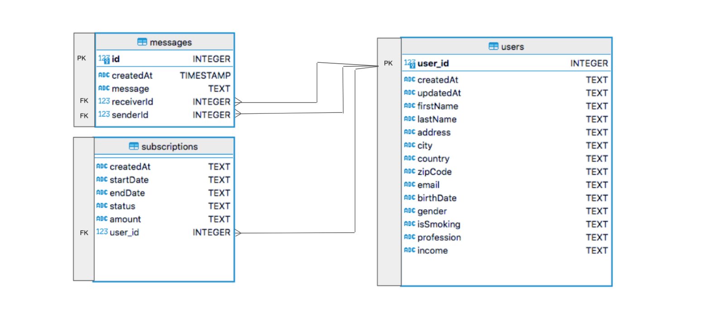

#  Spark - Junior Data Engineering Takehome Test


## Description

In this project I have developed the test for Junior Data Engineer role.

Talking about technologies, I have chosen: Sqlite to build the project instead of PostgreSQL or MySQL; only for make things and setup easier. If you need, I can modify settings to build it in other framework, database or technology; just said it to me.

Of course I could have implemented more features like data tests, detailed error messages, environment files to store critical variables like database name; but I have prefered to fullfill the requirements and overall show you the way I create Python code.


### Project

Before designing and building the project for me it's a good practice to create some Jupyter Notebooks, reading the source and mining data to understand them and think about how could I implement it efficiently. You can see them in analysis folder.

Also to create a realist data project and workflow I have created a scr folder with a etl folder inside and 3 files: 

* (src/etl) from source to database like a data integration process where extract, transform and load data:
 - db.py
 - main.py
 - utils.py

#### Model

Trying to follow best modeling practices I have decided to create two tables instead of only Global_Land_Temperatures_By_City. 

Following a Dimensional Model, the schema consists in:

* A dimensional table where store user entities.
* A fact table with users subscriptions
* A fact table where store every message sent and received to users entities by a foreign key.




#### Logs

Only for testing purposes I have added some terminal logs to check database setups, performance times, etc.

### Setup

Clone for Github repository.

```sh
git clone <repo_url>
```
### Python virtual environment

Check you have Python installed in your machine.

`python -V` or `python3 -V`

Then:
* Create Python Virtual Environment (if you want or install the libraries globally).
* Install requirements
* Run ETL script
* Run API script

```sh
python3 -m virtualenv venv
source venv/bin/activate # Activate virtual environment
python -m pip install -r requirements.txt
python src/etl/main.py
```
